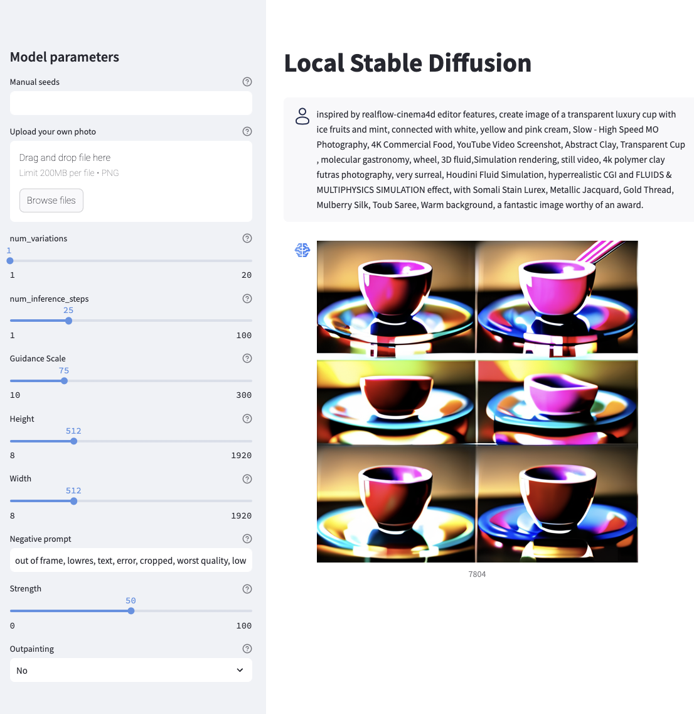

# streamlit_stablediffusion
Streamlit front end for image generation. Uses [stable-diffusion-xl-base-1.0](https://huggingface.co/stabilityai/stable-diffusion-xl-base-1.0) for txt2img and img2img, [ReV_Animated_Inpainting](https://huggingface.co/redstonehero/ReV_Animated_Inpainting) for outpainting.

## Setup
- Install required libraries
- The first time you run it, the models will be downoaded to `metadata/models/`
- In the `metadata/user_list.csv` file, put user names and emails. If the app is in use, it will tell you by who.
- run the app from the command line with `streamlit run app.py --server.port 8***` at whatever port you wish.
- To get the app online quickly, you can use [ngrok](https://www.sitepoint.com/use-ngrok-test-local-site/) to expose this local port to be able to access via the internet.

## User management
- The app has a password, which you can set by creating a `.streamlit/` directory in the base directory of the app, with a `secrets.toml` file inside containing password = "desired_password"
- You can change various theme options by creating a `.streamlit/config.toml` file, containin e.g.:

```
[theme]
primaryColor="#5b92E5"
backgroundColor="#FFFFFF"
secondaryBackgroundColor="#F0F2F6"
```
- Currently, the app supports only one concurrent user. The default behavior is to lock out other users while the app is in use. Other users will be locked out for 3 minutes from the last query run. You can change this length of time by changing this line: `st.session_state["available"] = (datetime.now() - st.session_state["last_used"]).total_seconds() > 180` in the `app.py` file.
- If a user has not run a query in 3 minutes, another user will be able to log on and the original user will be booted off.

## Changing model parameters
- Parameters are explained in the sidebar in their respective tooltips.
- To run outpainting, upload an image and set `Outpainting` to `Yes`, if it's set to `No`, it will run img2img
- The photo caption is the random seed for reproducibility

## Example image



